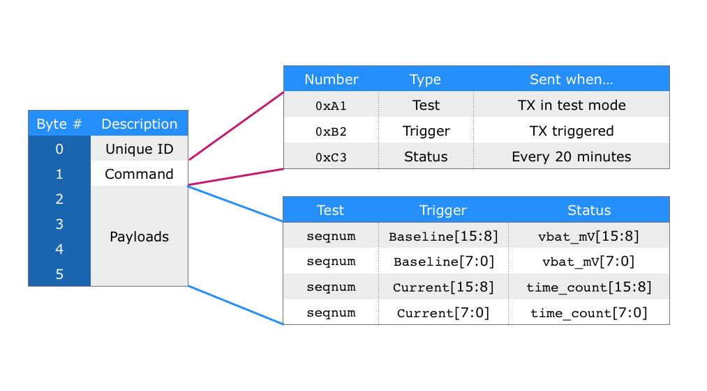
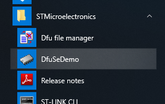
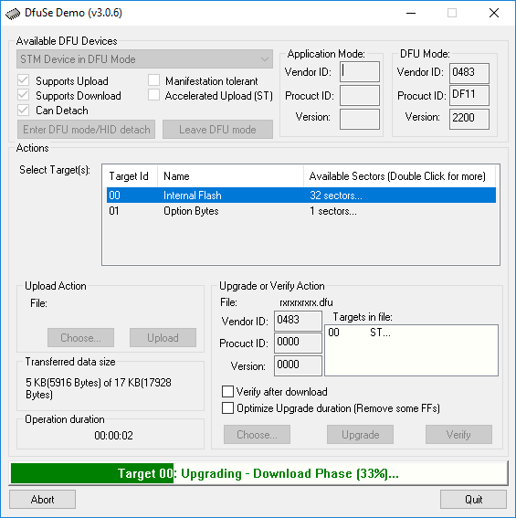

# Daytripper Advanced Usage Guide

[Main Page](/README.md) | [Buy Daytripper](https://www.tindie.com/products/dekuNukem/daytripper)

------

If you're not familiar with Daytripper yet, please see the [Quick Start Guide](/quick_start_guide.md) first.

## Custom Actions

Instead of hiding windows, you can perform custom actions when TX is triggered.

Slide the `Mode Select` Switch on RX to `CUSTOM`, middle position. Now `ALT + PAUSE` will be pressed when TX is triggered. 

This key combo normally doesn't do anything, but you can capture it with a software and then perform your own actions. 

### Windows 

You can use [autohotkey](https://www.autohotkey.com). Check out the [official tutorials](https://www.autohotkey.com/docs_1.0/Tutorial.htm), and here's a [sample configuration file](resources/AutoHotkey.ahk) upon which you can tinker with. 

### MacOS

Go to `System Preferences` -> `Keyboard` -> `Shortcuts` -> `App Shortcuts`

You can then add a shortcut to launch an application, or execute an applescript:

Of course there's always [bettertouchtool](https://folivora.ai) as well.

### Linux

Oh I'm sure you'll figure it out 😉

## On-air Packet Format

Daytripper uses a nRF24L01-compatible chip called Si24R1. It is much cheaper, and actually has a higher TX power output, resulting in longer communication range.

Daytripper operates at `channel 115`, `address 0xDA 0xBB 0xED 0xC0 0x0C`.

Data rate is `250kbps`, TX power is `+7dBm`, `Auto Acknowledgment` is used.

Daytripper TX sends 6-byte packets, details below:

* The first byte (byte 0) is a unique identifier calculated from the microcontroller serial number. 

* Second byte (byte 1) denotes what this packet is about. It can be either a test packet, trigger packet, or status update packet.

* The rest 4 bytes are payloads, the meaning depending on the command type. 

* For a `Test` packet, the 4 bytes are the same incrementing sequence number repeated 4 times. 

* For a `Trigger` packet, the first two bytes are the baseline reading of the power-up calibration. And the last two bytes are the actual distance reading. Unit in mm.

* For a `status` packet, the first two bytes are the latest battery voltage reading in mV. The last two bytes are the time-since-power-on count, multiply it by 5 to get the number of seconds elapsed since TX power-on.

* The `vbat_mV` is about 300mV lower than the actual battery voltage, due to the diode drop. 

## Debug Modes

There is a user button on both TX and RX board. Usually they are unused:

For TX, a short press (less than 2 seconds) recalibrates the baseline. A long press (more than 2 seconds) enters Test Mode, where it sends test packets with incrementing sequence number as payload every second. It can be used to test communication range. Turn it off then on again to exit Test Mode. 

For RX, a press on the button types out some debug messages. Make sure you open a text editor first. 

## USB Firmware Updates

You can update Daytripper's firmware via USB, for bug fixes and and/or new features. 

To do this, download and install the [STM32 DfuSe tool](resources/en.stsw-stm32080_stm32_DfuSe.zip) from this repo. You can download it from [the official website too](https://www.st.com/en/development-tools/stsw-stm32080.html) but it requires creating an account.

First, locate the user button on the board:

To update firmware:

* Make sure the board is OFF and unplugged.

* **Press and hold down the user button** while plugging it into a computer

If it all goes well, the status LED should stay off.

Now launch the `DfuSeDemo` software:

In the `Available DUF Devices` section at top left corner, you should see a `STM Device in DFU Mode`.

Press the `Choose...` button and select a firmware file in `.dfu` format. Make sure it's the correct file!

* [Click me](firmware/TX_latest.dfu) for latest default TX firmware

* [Click me](firmware/RX_latest.dfu) for latest default RX firmware

Press `Upgrade` button to start uploading the new firmware into the microcontroller.

And now the firmware is being updated!

It could take anywhere between a few seconds to a few minutes. Try using different USB ports if it is particularly slow. 

After uploading is complete, unplug and turn it back on to start using the new firmware. 

-----

If you generated a `.hex` file yourself, you can convert it to a `.dfu` file with the `Dfu file manager` and then upload this way. 

This method is nice for occasional firmware updates, but quite cumbersome if you want to do extensive reprogramming. It's faster to get a ST-Link programmer and use the Keil uVision IDE. [See this guide](https://github.com/dekuNukem/STM32_tutorials) for more information on STM32 developments.

## Using Multiple Modules

Daytripper wasn't designed with multiple TX/RX boards in mind. And I haven't done any extensive testings on this subject.

### Single RX Multiple TX

In this scenario RX will react when ANY of the multiple TX fires.

### Single TX Multiple RX

Here ALL of RX will react when TX fires.

### Multiple TX Multiple RX

Untested, probably a mess. 

## Questions or Comments?

Please feel free to [open an issue](https://github.com/dekuNukem/daytripper/issues). This is the preferred way since it helps other people too.

You can also email me at `dekunukem gmail com` for inquires.

------

[Main Page](/README.md) | [Buy Daytripper](https://www.tindie.com/products/dekuNukem/daytripper)
