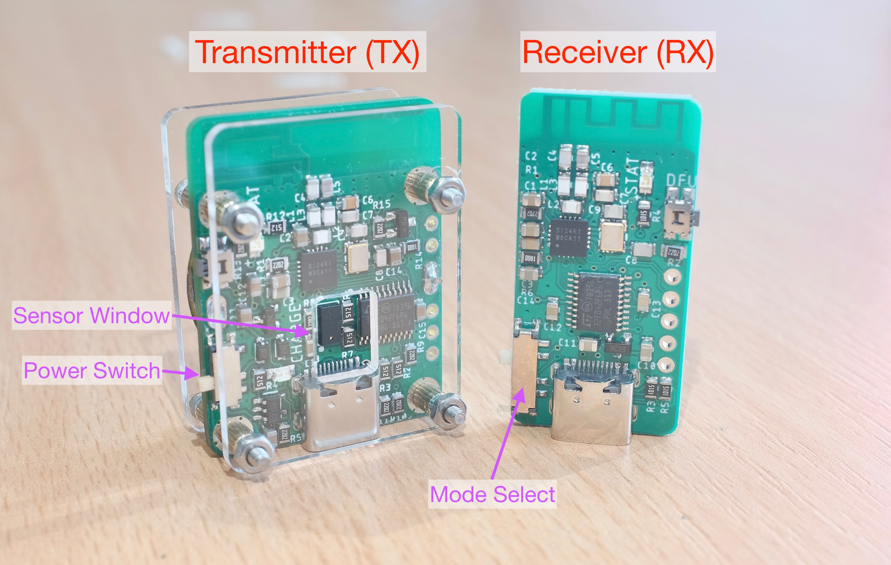
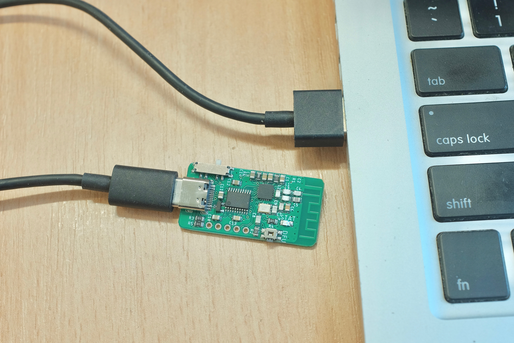
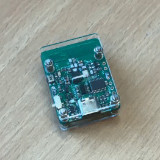
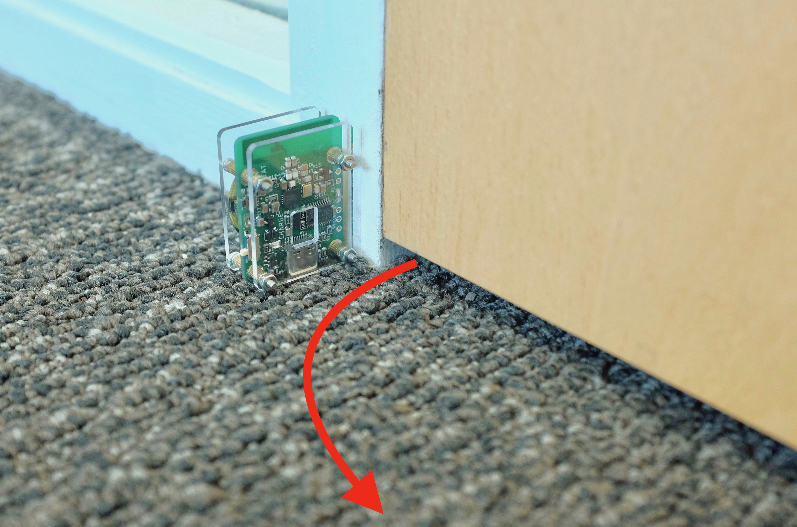
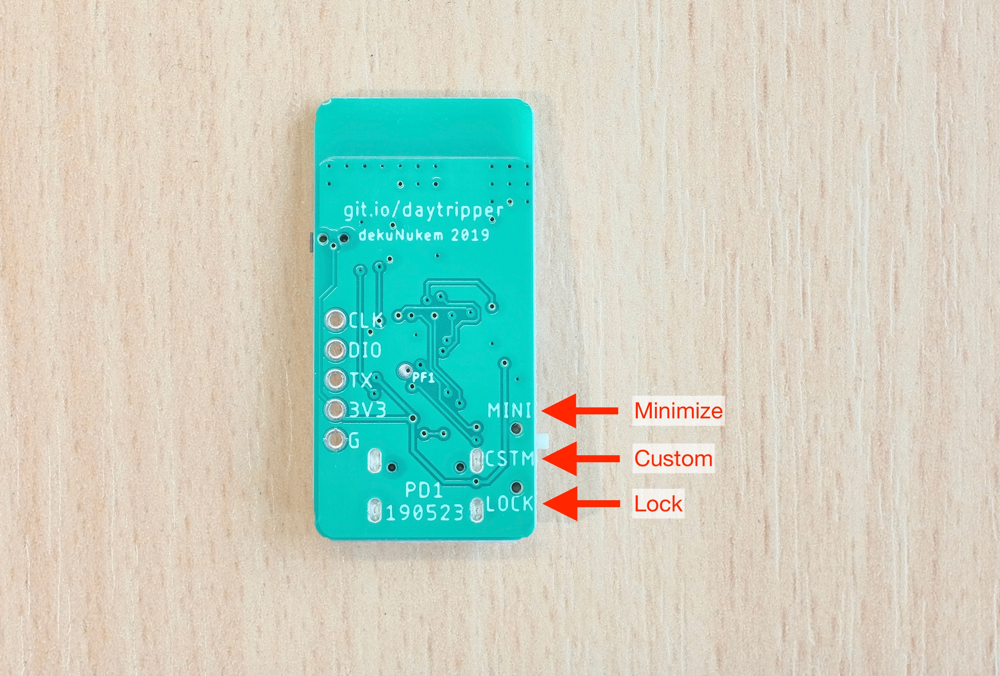
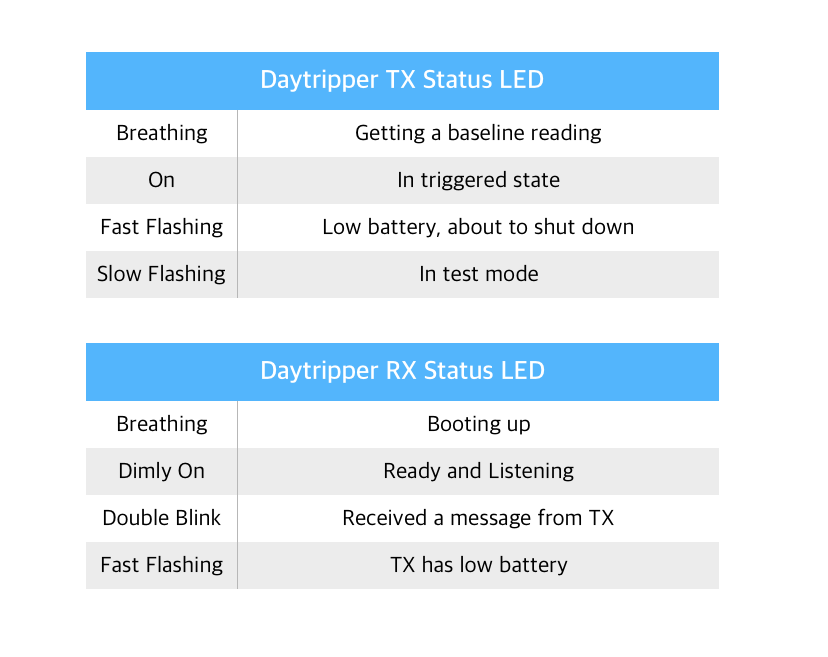

# Daytripper Quick Start Guide

[Main Page](/README.md) | [Buy Daytripper](https://www.tindie.com/products/dekuNukem/daytripper)

------

This guide shows you how to use the Daytripper.

If yours hasn't been assembled yet, please [see this guide to put it together](/assembly_guide.md)

## Getting Started

By now, you should have the assembled transmitter(TX) and receiver(RX) boards.

Please observe the various names that will be referred to later:

Your RX board might have a translucent protective cover, don't remove it!

Plug the RX into your computer. The blue LED should start breathing then go dim, and your PC should recognize it as an USB keyboard.

Put the TX flat on the table, make sure there is **no obstructions in front of the sensor window**.

Turn on the TX (gently!) using the power switch. The blue LED should start breathing as it gets a baseline reading.

The blue LED should eventually go out, that means TX is armed and ready. 

Now put your hand in front of the sensor window, all your windows should be minimized instantly.

That's pretty much the gist of it! However please do keep reading for more information.

## Mounting options

Now you know how Daytripper works, time to make it useful by mounting the TX at a desired location.

If you're trying to detect someone walking by, you can mount it to a wall using the magnet. Tape the magnet to the wall, then you can attach and detach the TX with ease. If you can find a metal surface, it's even easier:

If you're trying to detect a door opening, simply put it on the ground so the door opens into it.

Those are just two suggestions, you can get as creative as you want!

## Best Practices (Important!!!)

Daytripper works by utilizing a laser time-of-flight(ToF) sensor. It emits an eye-safe laser and measures the amount of time for the light to bounce back, thus calculating the distance. As a result, there are a number of best practices to keep in mind: 

* The laser works between 2cm to 120cm (0.8 to 47 inches), so make sure the motion happens within this range. 

* Daytripper works best in indoor conditions. Harsh ambient lighting such as direct sunlight might overwhelm the laser and affect detection range and sensitivity. 

* Certain materials might absorb the laser light instead of reflecting it back, affecting sensitivity. Those materials tends to be very deep black in color with a soft texture. 

* Daytripper is most sensitive if the laser can be bounced straight back from the subject instead of at an angle.

* The ToF sensor scans at 5 times a second, so it might miss a very fast-moving subject.

* The transmission range between TX and RX is around 100 meters (330 feet) in open air. Although it is likely to be shorter in indoor environments with walls and other wireless interferences.

* The battery on TX should last around 40 hours, depending on the number of triggers. You can recharge it using a USB Type-C cable.

## Tips and Tricks

* Always turn on the TX **`AFTER`** you finish mounting it, so the initial calibration won't get messed up by your hand.

* Test your setup! Test the mounting and the application/game you're trying to hide.

* If minimizing doesn't work with your game, you can change the `Mode Select` switch on RX to lock your computer instead.

* There is also a `Custom` option on the `Mode Select` switch, but that's for [advanced usages](/advanced_usage.md).

## Troubleshoot / Lights Meaning

Both TX and RX have a blue status LED. The meanings are detailed in tables below. 

TX boards also have a yellow LED, which comes on when the battery is charging.

## Advanced Usages

Once you're familiar with how Daytripper works, you can take a look at the [Advanced Usage Guide](/advanced_usage.md) for some additional features that might be of interest.

## Disclaimers

Although I have spent a lot of time on this project, I cannot guarantee its functionality in every condition.

This is not a safety device, do not use it for safety critical applications. 

I am not responsible for the consequences of using this device. Use it at your own risk. 

## Questions or Comments?

Please feel free to [open an issue](https://github.com/dekuNukem/daytripper/issues). This is the preferred way since it helps other people too.

You can also email me at `dekunukem gmail com` for inquires.

------

[Main Page](/README.md) | [Buy Daytripper](https://www.tindie.com/products/dekuNukem/daytripper)
